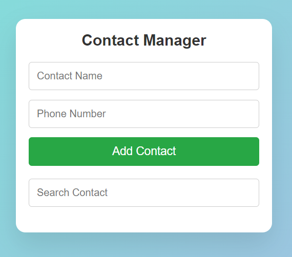

# Contact Manager App Project

This project is a simple **Contact Manager** application built with **JavaScript**, **HTML**, and **CSS**. It allows users to add, display, search, and delete contacts in an intuitive and modern interface. Contacts are stored locally using the browser’s **Local Storage**, ensuring data persistence even after refreshing the page.

## Table of Contents
- [Screenshot](#screenshot)
- [Features](#features)
- [Built With](#built-with)
- [Prerequisites](#prerequisites)
- [Usage](#usage)
- [Contact](#contact)

## Screenshot





<p align="right">(<a href="#table-of-contents">back to top</a>)</p>

## Features

- User-friendly interface for adding and managing contacts.
- Add new contacts with a name and phone number.
- Search for contacts using the search bar.
- Delete contacts with a single click.
- Contacts are stored locally using **Local Storage**, ensuring they persist across browser sessions.
- Responsive design with modern animations and user feedback through pop-up notifications.

<p align="right">(<a href="#table-of-contents">back to top</a>)</p>

## Built With

This project was built using the following technologies:

* 
* 
* 

<p align="right">(<a href="#table-of-contents">back to top</a>)</p>

## Prerequisites

To run this project, all you need is a modern web browser that supports HTML, CSS, and JavaScript. No additional libraries or dependencies are required.

<p align="right">(<a href="#table-of-contents">back to top</a>)</p>

## Usage

1. Clone the project from GitHub or download the files:
   ```bash
   git clone https://github.com/AmirrezaAhmadi/ContactManager-App.git

2. Open the ContactManager.html file in your browser.

<p align="right">(<a href="#table-of-contents">back to top</a>)</p>

## Contact

You can reach me through the following:

* Email: AmirrezaAhmadi.GH@Gmail.com
* Telegram: https://t.me/AmirrezaDevelop
* Instagram: https://www.instagram.com/codewithamirreza
* Project Link: https://github.com/AmirrezaAhmadi/ContactManager-App.git

<p align="right">(<a href="#table-of-contents">back to top</a>)</p>